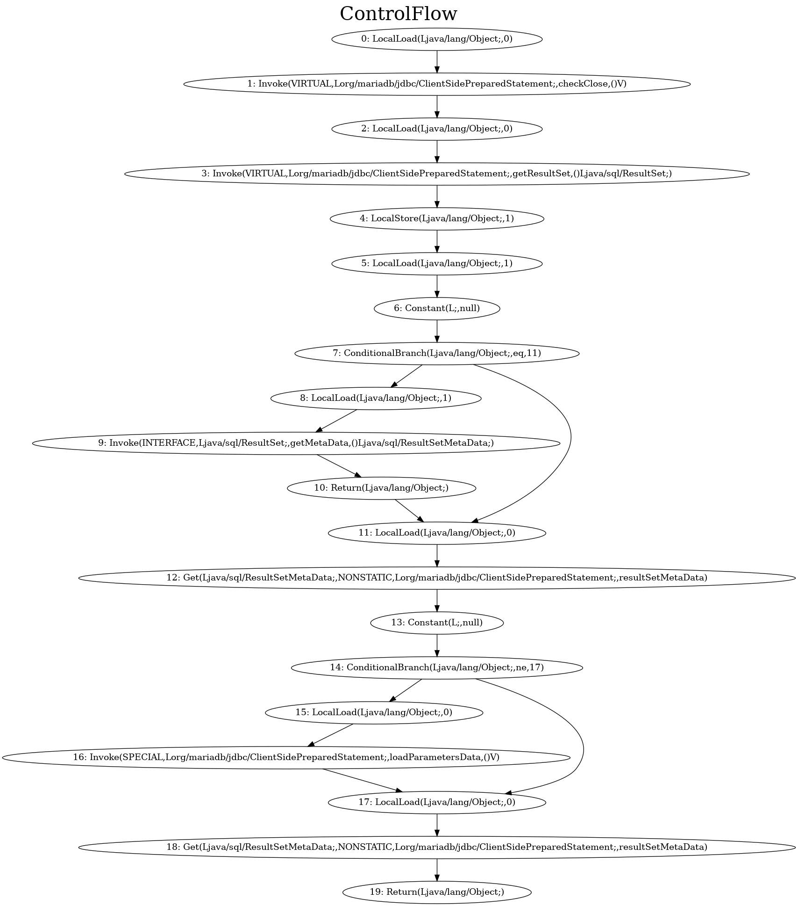

Slicer-Examples is a project with examples to show usage of [Slicer project](https://github.com/MethodResourcePrediction/Slicer).

---

Slice arbitary java bytecodes given one or multiple indexes which should be kept in the slice.

## Core Features

* Generates executable java slices
* Plotting graphs using dot (see below)
* Graph generation using [JGraphT](https://github.com/jgrapht/jgrapht)
	- Control Flow
	- Control Dependency
	- Block Dependency
	- Data Dependency
	- Argument Dependency
	- Class Object Dependency
	- Dominance (Post, Strict, Strict-Post, Immediate, Immediate-Post)

## Requirements

* Requires at least java language level 11
* Gradle build system
* WALA + WALA Shrike library with support for double-sized stack element processing ([see WALA #753 here](https://github.com/wala/WALA/issues/753))
* [Graphviz dot](https://gitlab.com/graphviz/graphviz/)   installed for potting graphs

## Setup


### Gradle integration

Add the following to your `build.gradle`. See [Notes](#notes) for the reason why there is another repo needed.

    repositories {
        ...
        maven {
            url = 'https://srv202.parsens.uni-kassel.de/repository/maven-snapshots/'
        }
    }
	
	dependencies {
	    compile group: 'de.uniks.vs.methodresourceprediction', name: 'slicer', version: '1.0.0-SNAPSHOT'
		...
	}

# Usage

## Select a method

To slice a method, the packaged jar has to be accessable. Let's slice the method `ClientSidePreparedStatement.getMetaData()` from [mariadb java connector](https://downloads.mariadb.org/connector-java/) (Version 2.7.2 at the time of writing). The interested slice criterion is for example line 4 here (the first if-statement).

Decompiled `ClientSidePreparedStatement.getMetaData()` source:

```java
 (1)  public ResultSetMetaData getMetaData() throws SQLException {
 (2)      this.checkClose();
 (3)      ResultSet rs = this.getResultSet();
 (4)      if (rs != null)   {
 (5)          return rs.getMetaData();
 (6)      } else {
 (7)          if (this.resultSetMetaData ==  null)   {
 (8)              this.loadParametersData();
 (9)          }
(10)          return this.resultSetMetaData;
(11)       }
(12)   }
```

## Construct the control flow graph

The resulting control flow graph is show below. More graphs can be found in [GraphExample.java](https://github.com/MethodResourcePrediction/Slicer-Examples/tree/master/src/main/java/de/uniks/methodresourceprediction/slicer/examples/GraphExample.java)



## Create a slice

Lets slice the instruction with index 7 in the control flow graph (the if-condition at line 4 in the java source above). The [SliceResult](https://github.com/MethodResourcePrediction/Slicer/blob/master/src/main/java/de/uniks/vs/methodresourceprediction/slicer/SliceResult.java) can be obtained using:

```java
// Create a Slicer object with jar file and signature
Slicer slicer = new Slicer();
slicer.setInputJar("path/to/mariadb-java-client-2.7.2.jar");
slicer.setMethodSignature("org.mariadb.jdbc.ClientSidePreparedStatement.getMetaData()Ljava/sql/ResultSetMetaData;");

// Set one or more slicing criterions
slicer.setInstructionIndexes(Set.of(7));

System.out.println(slicer.getSliceResult());
```

The output is:

	org.mariadb.jdbc.ClientSidePreparedStatement.getMetaData()Ljava/sql/ResultSetMetaData;
	InstructionIndexes: [7]
	InstructionIndexesToKeep: [17, 2, 18, 3, 19, 4, 5, 6, 7, 8, 9, 10]
	instructionIndexesToIgnore: [11]
	instructionPopMap: {}
	VarIndexesToRenumber: {}
	
	=== Slice ===
	  0: LocalLoad(Ljava/lang/Object;,0)
	  1: Invoke(VIRTUAL,Lorg/mariadb/jdbc/ClientSidePreparedStatement;,getResultSet,()Ljava/sql/ResultSet;)
	  2: LocalStore(Ljava/lang/Object;,1)
	  3: LocalLoad(Ljava/lang/Object;,1)
	  4: Constant(L;,null)
	  5: ConditionalBranch(Ljava/lang/Object;,eq,11)
	  6: LocalLoad(Ljava/lang/Object;,1)
	  7: Invoke(INTERFACE,Ljava/sql/ResultSet;,getMetaData,()Ljava/sql/ResultSetMetaData;)
	  8: Return(Ljava/lang/Object;)
	  9: Invoke(STATIC,Lde/uniks/vs/methodresourceprediction/slicer/export/Nothing;,doNothing,()V)
	 10: LocalLoad(Ljava/lang/Object;,0)
	 11: Get(Ljava/sql/ResultSetMetaData;,NONSTATIC,Lorg/mariadb/jdbc/ClientSidePreparedStatement;,resultSetMetaData)
	 12: Return(Ljava/lang/Object;)

## Understand the generated slice

* Bytecode instructions 0 and 1 were sliced out since there is no dependency to instruction 7 and the method return value
* Instruction 2 to 7 are copied unchanged (slice indexes 0 to 5) due to dependencies
* The instructions 8 to 10 are kept because there is a return statement at index 10 (slice indexes 6 to 8). Hence, the positive if-case is kept.
* Instructions between index 11 and 16 are sliced out (no dependency)
* The return statement at the end of the method (index 19) results in keeping instruction 10 to 12

Wait, what about the slice instruction at index 9? Where does it come from?

=> This instruction is added to deal as the jump target for the if-condition at index 5. The condition target (index 11) is not updated right here but during creation of the executable slice which is 9 afterwards.

## Create an executable slice

See [ExecutableSliceExample.java](https://github.com/MethodResourcePrediction/Slicer-Examples/tree/master/src/main/java/de/uniks/methodresourceprediction/slicer/examples/ExecutableSliceExample.java)

# Notes

The project uses a changed version of WALA-Shrike which supports processing double-sized stack elements ([see WALA #753](https://github.com/wala/WALA/issues/753) and [WALA-PR #775](https://github.com/wala/WALA/pull/775)). It is available as a snapshot on an own Sonatype Nexus instance [hosted at the University of Kassel](https://srv202.parsens.uni-kassel.de/). If you do not need the support for double-sized stack processing, the unmodified WALA-Shrike can be used. You just have to rebuild the depending projects (slicer, slicer-export, utils, ...).

Building on top of original WALA-Shrike currently means no support for primitive datatypes `double` and `long`! Please keep that in mind if your experience stack over-/underflow errors.


